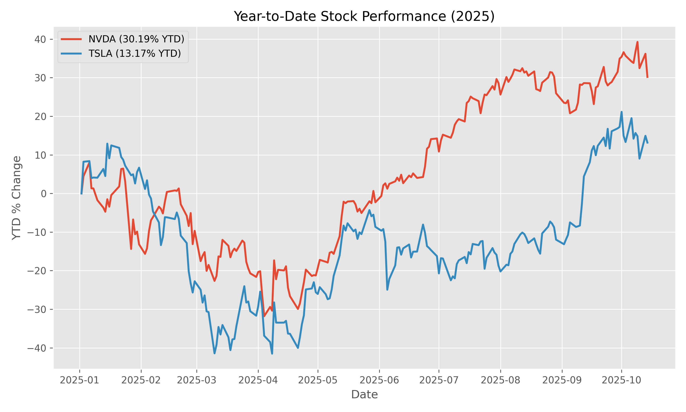
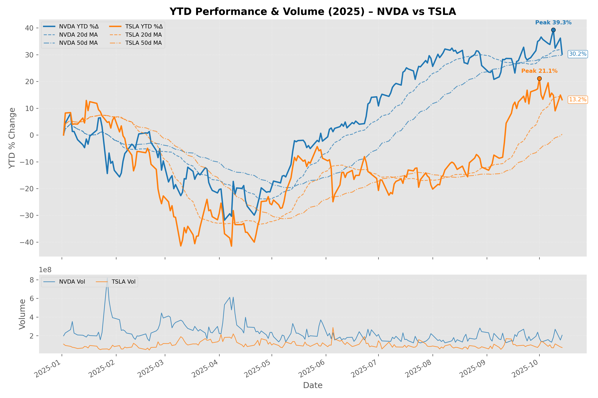
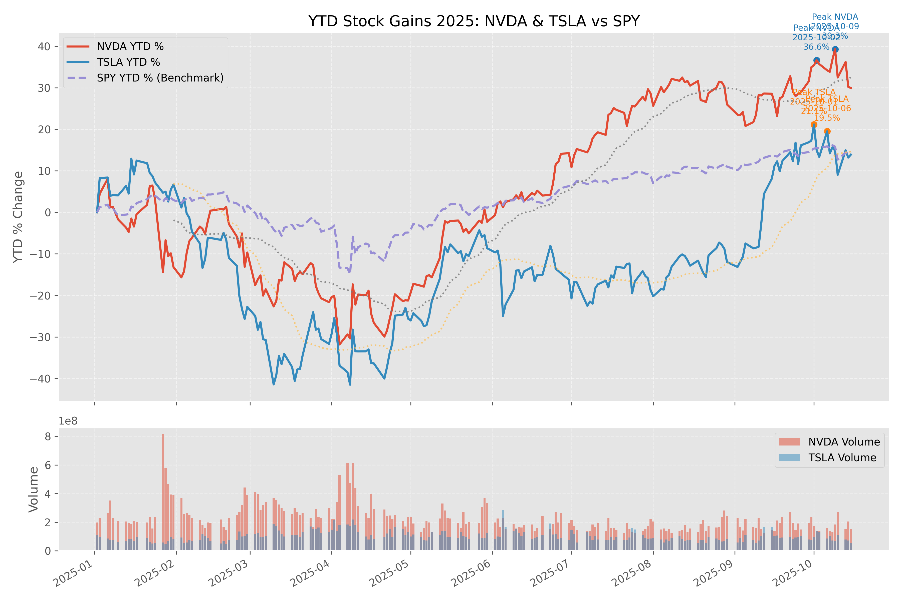
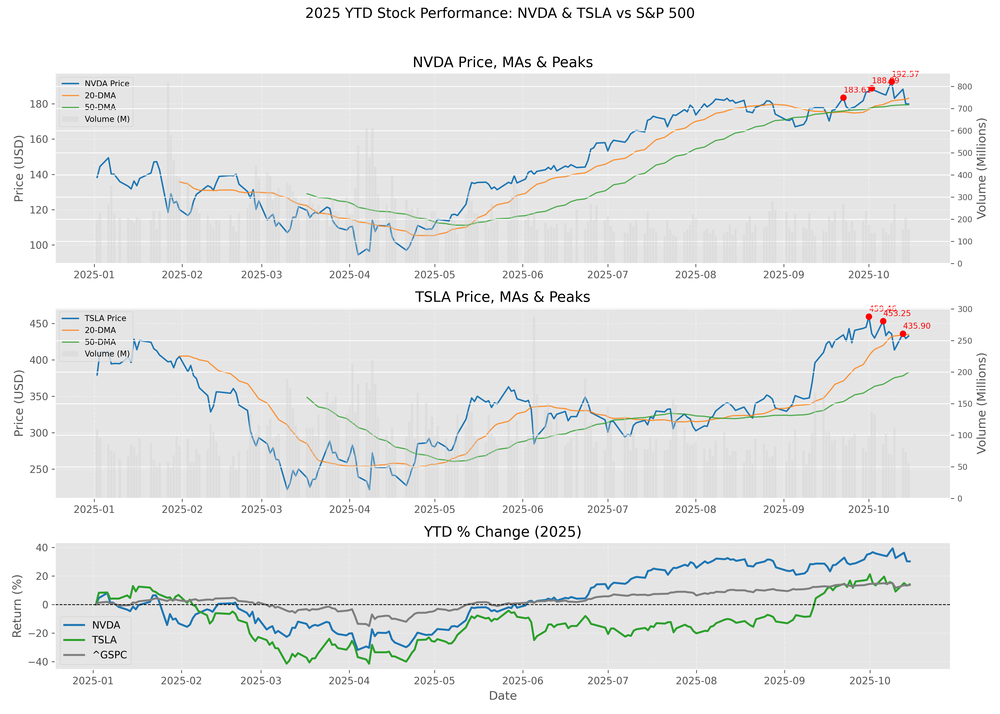
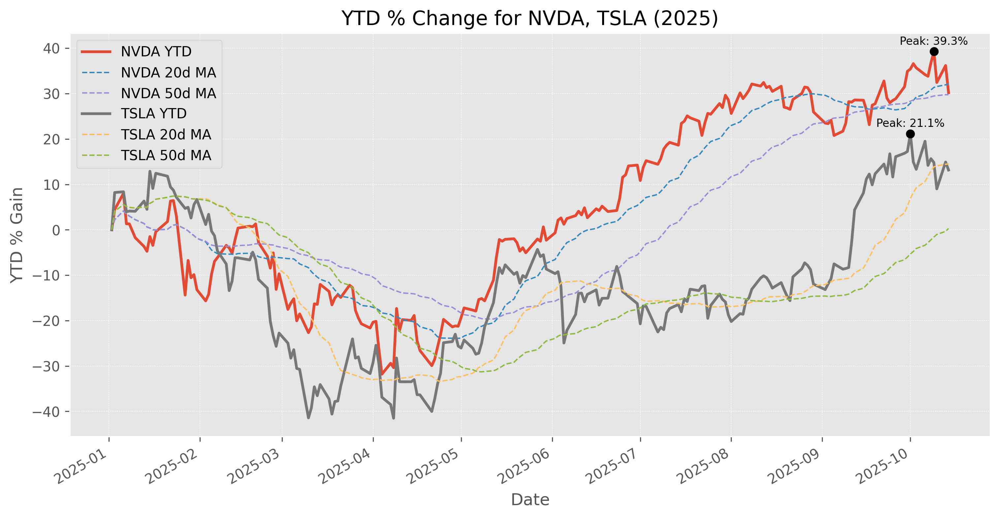

## Evolution Teaser (Progressive Plot Versions)

These five images illustrate the iterative evolution of the YTD stock plot as the agent system incorporated critic and user feedback. Each later version reflects added features (e.g., moving averages, volume, annotations, clarity refinements).

| Version | Preview |
|---------|---------|
| v001 |  |
| v004 |  |
| v007 |  |
| v010 |  |
| v012 |  |

<p align="center">
  
  
  <br/>
  
  
</p>

> Tip: New runs will append further versions; treat this gallery as a living progression of capability maturation.

# Evolving Stock Analysis (Agentic YTD Plot Generator)

AI‑driven iterative system that generates, executes, critiques, and improves year‑to‑date (YTD) stock performance plots using autonomous agent loops plus user feedback.

## Core Idea
1. Fetch YTD price data (yfinance).
2. Generate standalone Python plotting script (writer agent or fallback generator).
3. Execute script in isolated working directory (`coding/`).
4. Auto‑regenerate on execution failure (configurable retries).
5. Critic agent evaluates code & output context (without seeing the image directly).
6. System evolves internal feature sets (plot + data service).
7. User supplies higher‑level feedback; optional post‑feedback critic pass.
8. All iterations versioned & archived under `artifacts/<case_timestamp>/`.

---

## Key Features
- Dual feedback loops: AI critic + human user.
- Auto regeneration on failure with error‑aware prompts.
- Incremental evolution of:
  - Plot features: moving averages, volume subplot, annotations, peak highlights, style, colors, trend hints.
  - Data capabilities: technical indicators, volatility, RSI, MACD, risk metrics, correlation, benchmark comparison.
- Execution sandbox (`coding/`) with controlled working directory.
- Style fallback injection (prevents invalid matplotlib style crashes).
- Artifact capture: code snapshots, states, feedback, plots, data samples, evolution report.
- Post‑user‑feedback critic evaluation (`critic_post_user` entries).
- Normalized structured improvement plan display.
- Version awareness + history browsing.

---

## Architecture Overview
Component | Purpose
----------|--------
`app.py` | Streamlit UI + orchestration of loops
`agent_factory.py` | Factory for writer / critic / execution / evaluation agents
`plot_generator.py` | Stateful plot evolution engine
`stock_service.py` | Stateful data enrichment service
`code_generator.py` | Deterministic fallback code generator (non‑LLM)
`artifacts_manager.py` | Case & iteration persistence
`feedback_evaluator.py` | Scoring, trends, categorization (not shown here)
`config.py` | Azure/OpenAI model selection & LLM config

Execution Flow (non‑mock):
writer agent → code file → run (subprocess) → (auto-retry if fail) → critic agent → evolve (if not approved) → repeat until approved or max turns → user feedback → optional post‑user critic.

---

## Directory Structure (runtime)
```
stock/
  app.py
  agent_factory.py
  plot_generator.py
  stock_service.py
  code_generator.py
  artifacts_manager.py
  feedback_evaluator.py
  config.py
  coding/                # transient execution outputs (plot_script.py, ytd_stock_gains.png, state)
  artifacts/
    <case_timestamp>/
      plots/
      code/
      feedback/
      data/
      states/
      evolution_report.md
```

---

## Versioning Semantics
- Plot & data service each maintain an internal `version` (start at 1).
- Each evolution (critic or user) increments corresponding version.
- Displayed version mirrors internal (baseline v1).

---

## Iteration Workflow
1. User clicks “Start Analysis”.
2. Critic loop (up to Max Critic Turns):
   - Generate code (LLM or fallback).
   - Auto‑regenerate (Max Regen Attempts) until execution success or attempts exhausted.
   - Critic evaluates final attempt; may mark APPROVED.
   - On non‑approval: evolve + restart turn.
3. User feedback phase:
   - If satisfied → finalize & report.
   - If not → capture feedback, evolve, store artifacts, optional post‑feedback critic.

---

## Mock Mode vs Azure Mode
Mode | Writer | Critic | Regeneration | Post-user critic
-----|--------|--------|--------------|-----------------
Mock (default) | Internal fallback plotting | Template strings | No (simple evolution) | Not invoked
Azure (uncheck Mock) | LLM writer agent | LLM critic agent | Yes | Yes

If you do not configure Azure variables, keep Mock Mode ON.

---

## Environment Configuration (.env)
```
AZURE_OPENAI_API_KEY=...
AZURE_OPENAI_API_VERSION=2024-XX-XX
AZURE_OPENAI_ENDPOINT=https://<your-endpoint>.openai.azure.com
AZURE_OPENAI_MODEL=gpt-4o-mini   # or deployment name
AZURE_OPENAI_CODE_WRITER=...
AZURE_OPENAI_CODE_CRITIC=...
AZURE_OPENAI_CODE_EXE=...
```
If unset, app falls back to defaults; Mock Mode avoids remote calls.

---

## Quick Start
```bash
python -m venv .venv
# Windows: .venv\Scripts\activate
# Linux/Mac: source .venv/bin/activate
pip install -r requirements.txt  # create if missing
streamlit run app.py
```
Optional `requirements.txt`:
```
streamlit
yfinance
matplotlib
pandas
numpy
python-dotenv
```

---

## UI Controls
Sidebar:
- Mock Mode: toggle agentic LLM usage.
- Symbols: comma list (e.g., NVDA,TSLA,MSFT).
- Max Critic Turns: upper bound of critic refinement passes.
- Max Regen Attempts: internal code retry per critic turn (on execution failure).
- Critic Quality Threshold: minimal quality score + approval token.
- Reset Evolution: clears session state.

Main:
- Critic loop details per turn.
- Structured critic improvement plan.
- User feedback composer (quick text, guided, checkboxes).
- Versioned plot gallery.

---

## Auto-Regeneration Logic
Condition | Action
----------|-------
Execution fails (rc != 0) | Capture stderr snippet, augment next writer prompt
Retry count < Max Regen Attempts | Regenerate code
Final attempt still failing | Send failing code + error to critic

Critic sees: success flag, attempts used, last error snippet.

---

## Artifacts & Case Management
Saved per iteration:
- Plot image
- Generated code snapshots (auto-generated “V” classes for traceability)
- Service state & plot state JSON
- Feedback text (critic, user, post-user critic)
- Data sample (shape + last 5 rows)
- Evolution report (markdown) cumulative

Case naming: `<case_name>_YYYYMMDD_HHMMSS`.

---

## Feedback Processing
User feedback triggers:
- Version increment (plot & data service)
- Feature toggles inferred by keyword heuristics
- Optional critic post-evaluation (Azure mode)

Critic approval requires:
1. Presence of 'APPROVED'
2. Quality score ≥ threshold (or high score override in mock logic)

---

## Extensibility Ideas
Add new plot or data feature:
1. Extend `current_features` or `capabilities`.
2. Update `_apply_improvements` / `StockDataService.evolve`.
3. Adjust writer agent system message to mention new feature.
4. Update improvement plan categorization (feedback evaluator).

Swap LLM provider:
- Adjust `config.py` `_build_single_entry`.
- Provide deployment names matching new models.

Add safety filters:
- Pre-execution static scan to block forbidden imports.
- Execution timeout (already configurable in executor factory).

---

## Troubleshooting
Issue | Cause | Fix
------|-------|----
`FileNotFoundError` for style | Unsupported seaborn style | Fallback injection now handles; ensure code regenerated
No plot generated | Empty data / failed script | Check stderr in “Error Details” expander
Versions jump unexpectedly | Multiple evolutions in one run | Inspect artifacts timeline to confirm cause
Artifacts missing | Case not created | Ensure first “Start Analysis” triggered before feedback
Low quality score despite approval | Heuristic parser mismatch | Adjust evaluator or raise threshold

---

## Safety Considerations
- Code execution is local, unsandboxed: review before enabling untrusted inputs.
- No network restriction beyond yfinance; consider adding allowlist.
- Do not feed secrets via user feedback (stored in artifacts plain text).

---

## Limitations
- Critic does not view actual rendered image—infers quality from code.
- Keyword-based evolution may over-activate features.
- No concurrency handling for multiple sessions writing to same case name.

---

## Roadmap (Suggested)
- True image QA (embed-based or vision model).
- Feature registry + dependency graph.
- Structured semantic diff of iterative code.
- Sandbox (e.g., subprocess resource limits, seccomp).
- Caching layer for price data across cases.
- Pluggable scoring model (LLM JSON evaluator already scaffolded in factory).

---

## Cleaning Up
Remove temporary execution artifacts:
```
rm -rf coding/*.png coding/plot_script.py
```
Archive / prune old cases:
```
find artifacts -maxdepth 1 -type d -mtime +14 -exec rm -rf {} \;
```

---


## Attribution
Built with Streamlit, yfinance, matplotlib, and an agentic loop leveraging Azure/OpenAI (optional).
